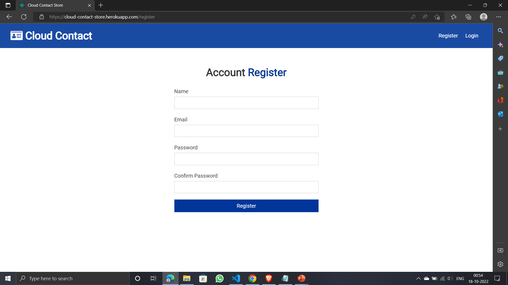
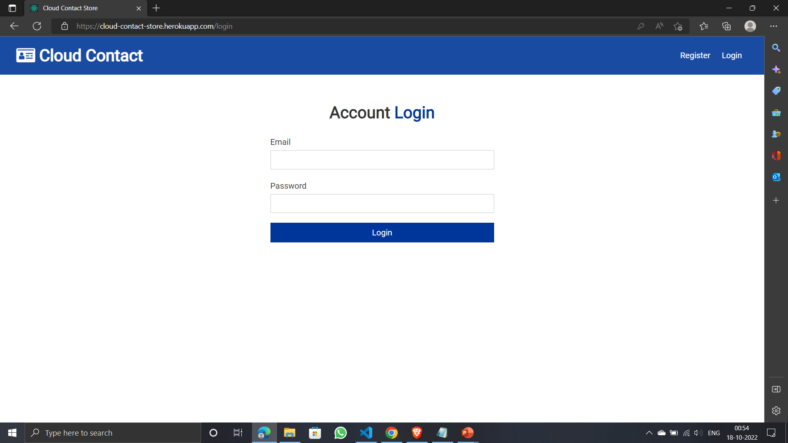

# Cloud Contact Store

## 🔗 Website Links

https://cloud-contact-store.herokuapp.com/

Cloud Contact App Where User can Register, Login and then keep and manage their contacts in the cloud. In this project i have use Node Js, Express, Mongodb for Serving api and React for Frontend.

# Install dependencies for server

```
npm install
```

# Install dependencies for client

```
npm run client-install
```

# Run the client & server with concurrently

```
npm run dev
```

# Run the Express server only

```
npm run server
```

# Run the React client only

```
npm run client
```

```
Server runs on http://localhost:5000 and client runs on http://localhost:3000
```

```
You need to setup your mongo database connection string in "config/default.json" folder and also the jwt secret
```

# Project screenshot

## User Register Page



## User Login Page



## Cloud Contact Page


